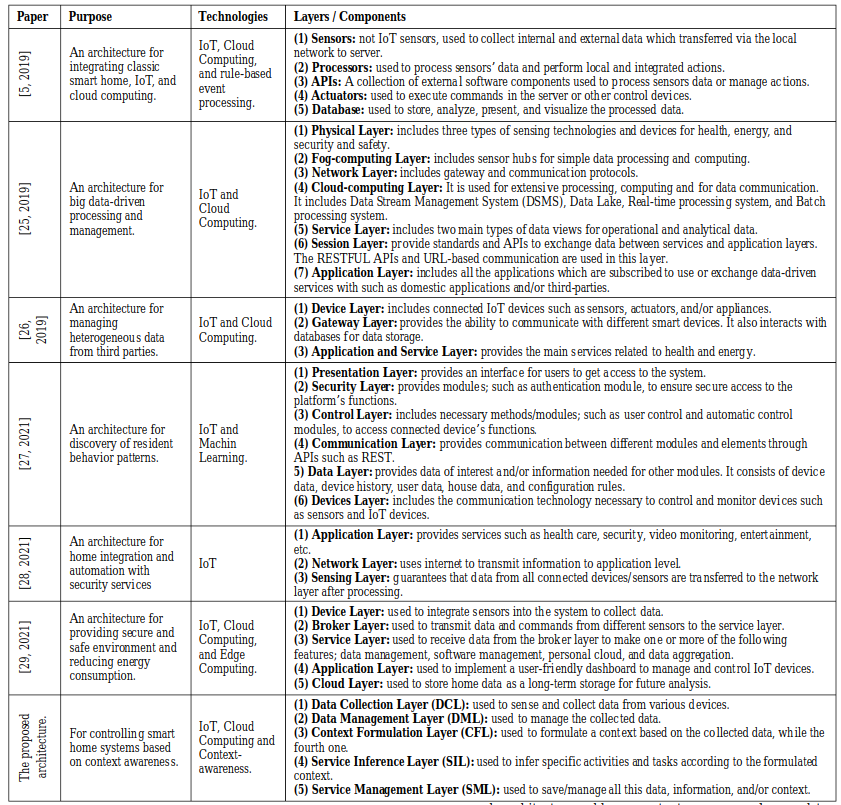
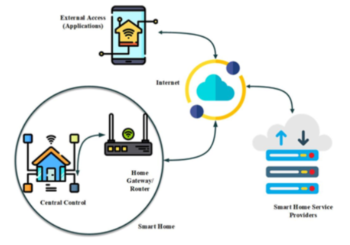
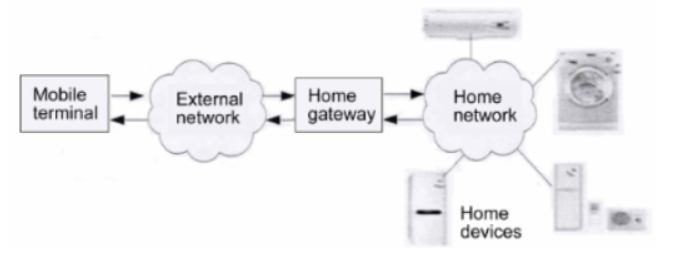
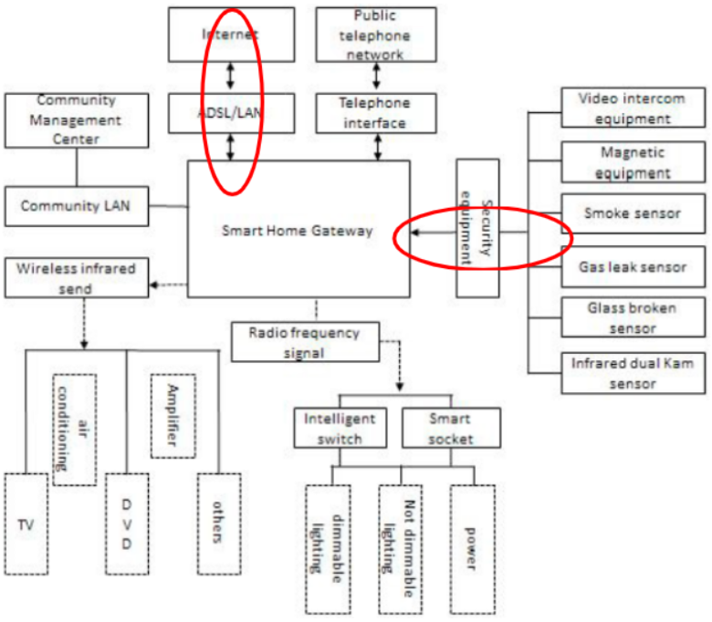

# Arhitektura Smart Home sistema

## Opšta arhitektura Smart Home sistema

Ne postoji univerzalna arhitektura za Smart Home sisteme, gde tabela izvučena iz [1] prikazuje više načina za organizaciju takvih sistema.

*Tipovi/predlozi Smart Home arhitekture [1]*

 

Uprkos različitim arhitekturama, postoje zajedničke komponente koje svaka arhitektura uključuje i to su:

#### 1. Server
Server je upravljačka jedinica cele strukture, a ne interno domaćinstva. To znači da se korisnikove instrukcije Smart Home sistemu šalju od korisničke aplikacije kroz server. Preko servera se dobavljaju podaci i informacije o uređajima, izvršavaju udaljene (remote) naredbe i akcije, itd. Server aktivno komunicira sa klijentskom aplikacijom i samim Smart Home-om. Predstavlja most između korisnika i Smart Home uređaja.

#### 2. Klijentska aplikacija
Obezbeđuje interfejs krajnjem korisniku za upotrebu i monitoring [6] Smart Home sistema. Od servera dobija monitoring podatke, a istom šalje upravljačke instrukcije za uređaje unutar sistema.

#### 3. Smart Home - deo sistema koji je meta bezbednosne analize u okviru ovog istraživanja i koja je detaljnije opisana ispod

 

## Smart Home
Smart Home sistem predstavljaju dve celine: Home Gateway i Home Network.

*Prikaz arhitekture na visokom niou 1*

*Prikaz arhitekture na visokom niou 2 [5]*

Ove dve slike prikazuju zajedničke komponente ovih sistema, i daju uvid u arhitekturu na visokom nivou. Sa ovih slika se može zaključiti da se Smart Home sistem ne može posmatrati potpuno nezavisno, zbog neophodne interakcije sa korisnikom, odnosno serverom. U pitanju je standardna http(s)/websocket komunikacija (upotreba eksterne aplikacije/interfejsa i servera).
Ova dva dijagrama arhitekture Smart Home sistema će poslužiti kao početna tačka za dekompoziciju modula.

 

### Home Gateway
Gateway [2][3][4] je centralna upravljačka jedinica Smart Home sistema. Predstavlja jezgro smart home sistema (system control center), preko koga se kontrolišu sve ostale komponente.

Preko gateway-a se razmenjuju podaci sa eksternom mrežom. 

Često se naziva i protocol conversion gateway, zbog toga što komunicira sa uređajima celog sistema po različitim standardima komunikacije, koji tim uređajima odgovaraju.

**U suštini, gateway omogućava remote control celog sistema.**

Glavne funkcije Gateway-a [2] su sledeće:
* Sense Network Access (pristup mreži):
    * dobija informacije o svakom čvoru, status svakog čvora,
    * remote control čvorova,
    * i dijagnoza čvorova.
* Interoperability of Heterogeneous Networks:
    * povezivanje uređaja koji koriste različite tehnologije, sisteme, protokole…
* Standardizacija komunikacije:
    * usklađivanje komunikacija sa čvorovima/senzorima/uređajima i njegovim standardima;
    * zbog toga se i zove protocol conversion gateway.

 

### Home network
Home network [5] je sačinjen od čvorova, odnosno uređaja koji služe za automatizaciju, sigurnost i upravljanje potrošnjom. Može da koristi žičano ili bežično povezivanje.

Vrste uređaja:
 * aktuatori,
 * smart appliances,
 * i sigurnosni uređaji i senzori.

Aktuatori mogu biti:
* sockets - utičnice,
* valves - ventili,
* i switches - prekidači.

Smart sockets [3] su uređaji koji se instaliraju u utičnicu na koju se povezuje neki električni uređaj. Oni prate i regulišu rad povezanog uređaja, kao i potrošnju struje. Na zahtev, ili automatizovano, mogu isključivati i uključivati uređaje.

Na sličan način rade i ventili i prekidači [4], regulišu potrošnju i omogućavaju on/off funkcionalnosti.

Smart apliances su pametni uređaji poput pametnih klima, frižidera, televizora, i slično.

Sigurnosni uređaji [3] predstavljaju kamere, pametne brave i njima slične uređaje. Dakle, zaduženi su za bezbednost doma.
U ovu grupu se najčešće ubrajaju i senzori, iako oni sami po sebi ne moraju nužno biti vezani za sigurnost. To mogu biti senzori za dim, gas, temperaturu, itd.

 

## Važni aspekti za posmatranje sigurnosti Smart Home sistema
[po savetu prof. Vidakovića]

1. Komunikacija od eksterne aplikacije ka gateway-u
    * svi standardni problemi obezbeđivanja mrežnog sistema, komunikacije, podataka, itd.
2. Komunikacija od gateway-a ka senzorima
    * obezbeđivanje senzora (u zavisnosti od njihove mogućnosti, arhitekture, itd.)
    * povezivanje i organizacija uređaja (wifi i njegovi problemi, mrežni pristup, itd.)

Detaljniji prikaz arhitekture [3], koji će poslužiti za detaljniju dekompoziciju, sa fokusom na ključne sigurnosne mofule, odnosno tokove komunikacije/podataka.

 

## Literatura

[1] A Proposed Architecture for Smart Home Systems Based on IoT, Context-awareness and Cloud Computing: Samah A. Z. Hassan, Ahmed M. Eassa

[2] https://www.dusuniot.com/blog/what-are-smart-gateways-why-would-you-need-one/

[3] Smart Home Architecture, Technologies and Systems: Min Li, Wenbin Gub, Wei Chenc, Yeshen Hed, Yannian Wud, Yiying Zhange

[4] An Overview of IoT-Based Architecture Modelfor Smart Home Systems: Odamboy Djumanazarov, Antti Väänänen, Keijo Haataja, Pekka Toivanen

[5] Design of Smart Home System Based on ZigBee Technology and R&D for Application: Lin Gao, Zhixin Wang, Jianlong Zhou, Chao Zhang

[6] https://www.techopedia.com/definition/4313/monitoring-software