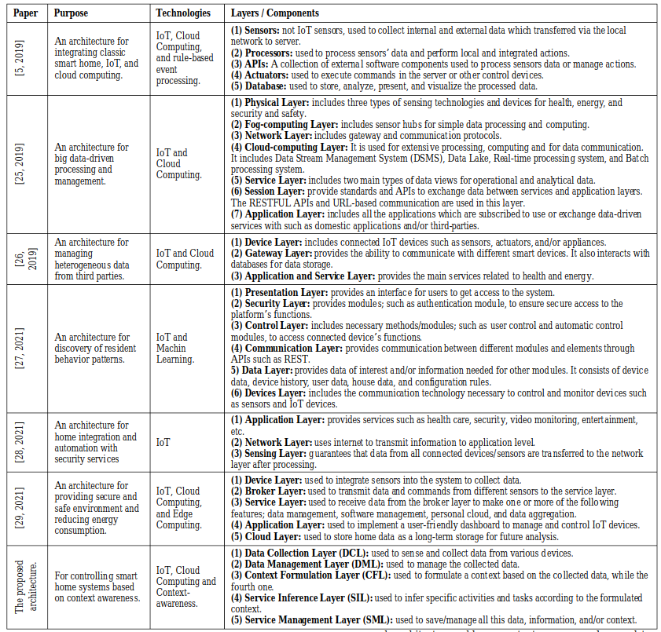

# Predlog teme projekta
## Model pretnji Smart Home sistema: Fokus na sigurnosti Home gateway-a

 

## Opšta arhitektura Smart Home sistema

Ne postoji univerzalna arhitektura za Smart Home sistem, ali postoje celine koje ima gotovo svaki sistem:
1. Server
2. Klijentska aplikacija
3. Smart Home 

*Tipovi/predlozi Smart Home arhitekture*

[A Proposed Architecture for Smart Home Systems Based on IoT, Context-awareness and Cloud Computing: Samah A. Z. Hassan, Ahmed M. Eassa]

 

### Server
Server je upravljačka jedinica cele strukture (ne interno Smart Home sistema). Preko servera se dobavljaju podaci i informacije o uređajima, izvršavaju udaljene (remote) naredbe i akcije, itd. Server aktivno komunicira sa klijentskom aplikacijom i samim Smart Home-om. Predstavlja most između korisnika i Smart Home uređaja.

### Klijentska aplikacija
Obezbeđuje platformu, odnosno interfejs krajnjem korisniku za upotrebu i monitoring Smart Home sistema. Od servera dobija monitoring podatke, a istom šalje upravljačke instrukcije za uređaje unutar sistema.

### Smart Home
Smart Home sistem predstavljaju dve celine: Home network i Gateway.

Gateway je centralna jedinica Smart Home sistema

Home network je sačinjen od čvorova, odnosno uređaja koji služe za automatizaciju, sigurnost i upravljanje potrošnjom. Može da koristi žičano ili bežično povezivanje.

(Detaljnije u nastavku)

[Design of Smart Home System Based on ZigBee Technology and R&D for Application: Lin Gao, Zhixin Wang, Jianlong Zhou, Chao Zhang]

 

Smart Home sistem se ne može posmatrati potpuno nezavisno, zbog neophodne interakcije sa korisnikom, odnosno serverom. U pitanju je standardna http(s)/websocket komunikacija (upotreba eksterne aplikacije/interfejsa i servera).

 

Ova dva dijagrama arhitekture Smart Home sistema će poslužiti kao početna tačka za dekompoziciju modula.

[Design of Smart Home System Based on ZigBee Technology and R&D for Application: Lin Gao, Zhixin Wang, Jianlong Zhou, Chao Zhang]

 

## Home Gateway
Preko gateway-a se razmenjuju podaci sa eksternom mrežom Predstavlja jezgro smart home sistema (system control center).

Često se naziva i protocol conversion gateway.

**U suštini, gateway omogućava remote control celog sistema.**

Gateway funkcije:
* Sense Network Access (pristup mreži)
    * dobija informacije o svakom čvoru, status svakog čvora
    * remote control čvorova
    * dijagnoza čvorova
* Interoperability of Heterogeneous Networks
    * ovezivanje uređaja koji koriste različite tehnologije, sisteme, protokole…
* Standardizacija komunikacije
    * mora da se uskladi komunikacija sa čvorovima/senzorima/uređajima i njegovim standardima
    * zbog toga se i zove protocol conversion gateway

[https://www.dusuniot.com/blog/what-are-smart-gateways-why-would-you-need-one/]

 

## Uređaji Home network-a
Vrste uređaja:
 * Aktuatori
    * Sockets - utičnice
    * Valves - ventil
    * Switches - prekidači 
 * Smart appliances
 * Sigurnosni uređaji i senzori

Smart sockets su uređaji koji se instaliraju u utičnicu na koju se povezuje neki električni uređaj. Oni prate i regulišu rad povezanog uređaja, kao i potrošnju struje. Na zahtev, ili automatizovano, mogu isključivati i uključivati uređaje.

Na sličan način rade i ventili i prekidači, regulišu potrošnju i omogućavaju on/off funkcionalnosti.

[An Overview of IoT-Based Architecture Modelfor Smart Home Systems: Odamboy Djumanazarov, Antti Väänänen, Keijo Haataja, Pekka Toivanen]

Smart apliances su pametni uređaji poput pametnih kliva, frižidera, televizora, i slično.

Sigurnosni uređaji predstavljaju kamere, pametne brave i njima slične uređaje. Dakle, zaduženi su za bezbednost doma.
U ovu grupu se najčešće ubrajaju i senzori, iako oni sami po sebi ne moraju nužno biti vezani za sigurnost. To mogu biti senzori za dim, gas, temperaturu, itd.

[Smart Home：Architecture, Technologies and Systems: Min Li, Wenbin Gub, Wei Chenc, Yeshen Hed, Yannian Wud, Yiying Zhange]

 

## Važni aspekti za posmatranje sigurnosti Smart Home sistema
*(po savetu prof. Vidakovića)*
1. Komunikacija od eksterne aplikacije ka gateway-u
    * svi standardni problemi obezbeđivanja mrežnog sistema, komunikacije, podataka, itd.
2. Komunikacija od gateway-a ka senzorima
    * obezbeđivanje senzora (u zavisnosti od njihove mogućnosti, arhitekture, itd.)
    * povezivanje i organizacija uređaja (wifi i njegovi problemi, mrežni pristup, itd.)

 

Detaljniji prikaz arhitekture, koji će poslužiti za detaljniju dekompoziciju, sa fokusom na ključne sigurnosne mofule, odnosno tokove komunikacije/podataka.

[Smart Home：Architecture, Technologies and Systems: Min Li, Wenbin Gub, Wei Chenc, Yeshen Hed, Yannian Wud, Yiying Zhange]