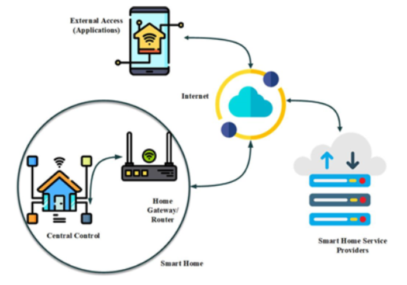
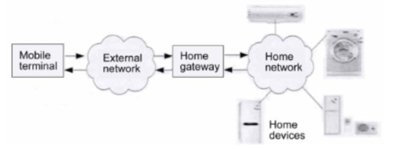
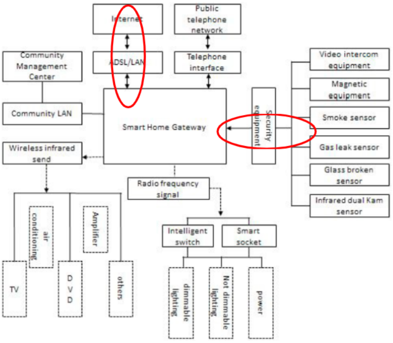

# Predlog teme projekta
## Model pretnji Smart Home sistema: Fokus na sigurnosti Home gateway-a

 

### Opšta arhitektura Smart Home sistema
Smart Home sistem se ne može posmatrati potpuno nezavisno, zbog neophodne interakcije sa korisnikom, koja se obavlja na standardan način, putem Interneta (upotreba eksterne aplikacije/interfejsa i servera).
 

Ova dva dijagrama arhitekture Smart Home sistema će poslužiti kao početna tačka za dekompoziciju modula.

 

### Home Gateway
Preko gateway-a se razmenjuju podaci sa eksternom mrežom
* jezgro smart home sistema
* predstavlja system control center
* zove se i protocol conversion gateway
* **u suštini, omogućava remote control celog sistema**

Gateway funkcije:
* Sense Network Access (pristup mreži)
    * dobija informacije o svakom čvoru, status svakog čvora
    * remote control čvorova
    * dijagnoza čvorova
* Interoperability of Heterogeneous Networks
    * ovezivanje uređaja koji koriste različite tehnologije, sisteme, protokole…
* Standardizacija komunikacije
    * mora da se uskladi komunikacija sa čvorovima/senzorima/uređajima i njegovim standardima
    * zbog toga se i zove protocol conversion gateway

 

### Važni aspekti za posmatranje sigurnosti Smart Home sistema
*(po savetu prof. Vidakovića)*
1. Komunikacija od eksterne aplikacije ka gateway-u
    * svi standardni problemi obezbeđivanja mrežnog sistema, komunikacije, podataka, itd.
2. Komunikacija od gateway-a ka senzorima
    * obezbeđivanje senzora (u zavisnosti od njihove mogućnosti, arhitekture, itd.)
    * povezivanje i organizacija uređaja (wifi i njegovi problemi, mrežni pristup, itd.)
 

Detaljniji prikaz arhitekture, koji će poslužiti za detaljniju dekompoziciju, sa fokusom na ključne sigurnosne mofule, odnosno tokove komunikacije/podataka.