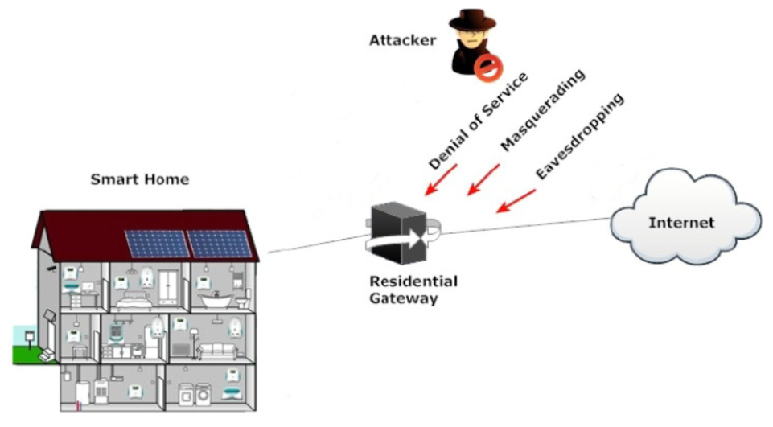

# Analiza pretnji

U ovom dokumenti su izdvojene ključne mete napada. Za iste je odrađena analiza pretnji, odnosno izdvojene su ranjivosti i napadi, kao i mitigacije ili odbrane koje te napade ublažavaju ili sprečavaju.

 

## Smart Home sistem (Network i Gateway)
 

### Pretnje

Inicijalno će se analiza pretnji posvetiti identifikaciji i pregledu nekoliko opštih napada sa kojima Smart Home sistem može da se sretne. Taj pregled će omogućiti sticanje osvnog razumevanja sigurnosnih izazova sa kojima vlasnici pametnih domaćinstava mogu da se suoče.

Nakon toga, analiza pretnji će se usmeriti na detaljniju konstrukciju primenom STRIDE modela. 

 

Osvrt na sigurnost može biti veliki izazov zbog heterogene prirode ovih sistema, odnosno zbog raznolikosti mehanizama samih uređaja, kao i postojanja različitih protokola komunikacije koji u isto vreme mogu da postoje u istom sistemu [1].

Neki od protokola [1] su:
- **Žičani:** Homeplug, X10, Batibus, Cebus, Ethernet, USB
- **Bežični:** IEEE 802.11 (opšte poznat kao Wi-Fi), Bluetooth, Zigbee [2], Hiperlan

Zbog toga, sprovođenje sigurnosti često varira od uređaja do uređaja. Tako na primer, u slučaju bežičnog sistema, ako napadač uspe da ostvari nekakav pristup, velika je šansa da može doći do poverljivih informacija o korisniku ili može manipulisati njima.

Wi-Fi mreže mogu biti podložne napadima [3] zbog korišćenja fabrički postavljenih ili slabih lozinki, kao i zbog korišćenja ranjivih protokola za šifrovanje. Korišćenje podrazumevanih pristupnih podataka omogućava napadaču da bez ikakvog truda pristupi ruteru, a samim tim i smart home sistemu.

 

Neki od čestih napada [1] su:
1. Eavesdropping/Monitoring, odnosno praćenje saobraćaja ka i od smart home mreže, bez znanja vlasnika sistema, gde se mogu pokupiti određeni poverljivi podaci. To je jedan od češćih napada, koji spada u *Information disclosure*.
2. Masquerading, odnosno maskiranje je imitacija korisnika sistema, u cilju dobavljanja poverljivih podataka. Spada u *Spoofing of user identity*.
3. Network unavailability je tipičan primer *Denial of service* napada. Ima cilj da osposobi mrežu da autentifikuje korisnika, zabrani mu pristup ili da onesposobi samu mrežu.
4. itd.

Česti napadi na smart home okruženja

 

### STRIDE

U narednom delu je izrađena analiza pretnji primenom STRIDE metode. Pre svega je na modulu Smart Networka definisana površina napada, odnosno definisane su tačke koje napadač može da presretne ili napadne.

Nakon toga su definisane liste pretnji po STRIDE-u.

 

Dekompozicija modula: prikaz površina napada

1. Fizički napad na uređaje, što retko izvodljiva i često nepristupačna opcija.
2. Napad na Gateway (preuzimanje kontrole ili presretanje komunikacije), gde se dolazi do kompletne kontrole nad sistemom.
3. Napad na mrežu, gde se ostvaruje pristup svim povezanim uređajima.
4. Napad na server i komunikacija sa Smart Home-om putem kanala server-gateway.  

 

*STRIDE liste su razložene po sledećoj strukturi:*
- *Tip pretnje i opis*
    - *Uređaj/mrežni sloj (meta)*
        - *Pretnje*
- *Mitigacije*

 Prva lista se odnosi na pretnje samih uređaja, dok se druga odnosi na komunikacioni sloj sistema.

 

Lista 1: pretnje uređaja [4]

1. **SPOOFING** (Napadač se pretvara da je neko drugi ili falsifikuje podatke)
- Senzori
    - Pristup mreži kroz password cracking: Ako napadač pristupi mreži, može da čita podatke sa senzora.
    - Man in the middle: Napadač može da presretne podatke sa senzora i umetne svoje.
    - Neautorizovani senzor može da se ubaci u sistem, i pokvari stvarne podatke.
- Aktuatori
    - Spoofing aktuatora može dovesti do izdavanja lažnih naredbi i kontrola.

1. Mitigacije:
    - Postavljanje jakih i složenih šifri, koje će se menjati na određeni vremenski period.
    - Enkripcija i sigurni komunikacioni protokoli da bi se sprečio man in the middle.
    - Dodavanje autentifikacije uređaja, kako bi se osigurao pristup sistemu od strane senzora.
    - Autentifikacija i autorizacija pre svake komande aktuatora.
    - Monitoring aktivnosti aktuatora.

 

2. **TAMPERING** (Napadač modifikuje sistem, podatke, ponašanje komponenata...)
- Senzori
    - Isključivanje senzora, što totalno onesposobljava funkcionisanje smart home-a.
    - Buffer overflow, koji može da dovede do grešaka u sistemu i do neautorizovanog pristupa.
- Aktuatori
    - Isključivanje aktuatora, što narušava rad sistema.
    - Buffer overflow, koji može da dovede do grešaka u sistemu i do neautorizovanog pristupa.

2. Mitigacije:
    - Ubacivanje sigurnih napajanja u sistem; dodavanje neprekidnih napajanja, kako bi se rad senzora i aktuatora nastavio. Autorizacija i autentifikacija za on/off komande.
    - Sigurna implementacija i validacija svih unosa kako bi se sprovela zaštita od buffer overflow-a.

 

## Server i klijentska aplikacija

 

## Literatura:

[1] A Study of Smart Home Environment and its Security Threats: Shafiq Ul Rehman, Selvakumar Manickam

[2] A ZigBee-Based Home Automation System: Khusvinder Gill, Shuang-Hua Yang, Fang Yao, Xin Lu

[3] https://www.wevolver.com/article/smart-home-security-security-and-vulnerabilities

[4] Threat Model and Risk Management for a Smart Home IoT System: Ahmed Redha Mahlous