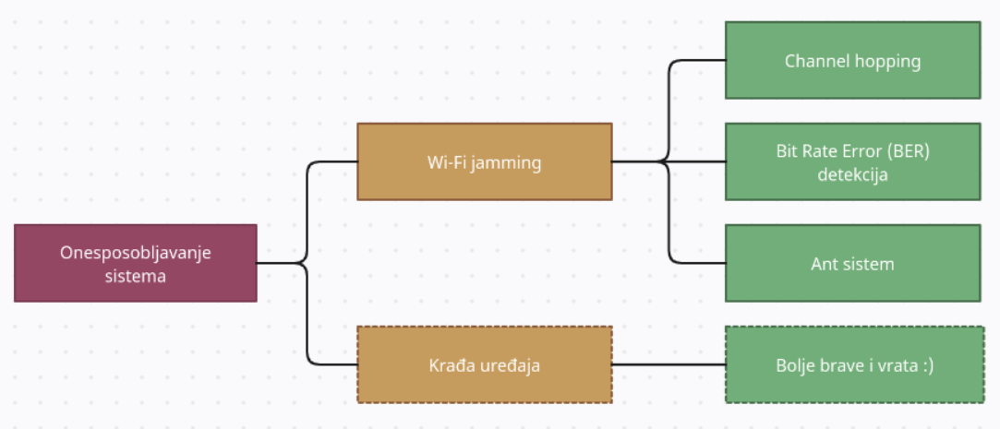

# Analiza pretnji

U ovom dokumenti su izdvojene ključne mete napada. Za neke od njih je odrađena analiza pretnji, odnosno izdvojeni su napadi, kao i mitigacije ili odbrane koje te napade ublažavaju ili sprečavaju.

 

## Uvod

Ovaj dokument će se posvetiti identifikaciji i pregledu nekoliko opštih pretnji i napada sa kojima Smart Home sistem može da se sretne. Taj pregled će omogućiti sticanje osnovnog razumevanja sigurnosnih izazova sa kojima vlasnici pametnih domaćinstava mogu da se suoče.

Osvrt na sigurnost može biti veliki izazov zbog heterogene prirode ovih sistema, odnosno zbog raznolikosti mehanizama samih uređaja, kao i postojanja različitih protokola komunikacije koji u isto vreme mogu da postoje u istom sistemu [1].

Neki od protokola [1] su:
- **Žičani:** Homeplug, X10, Batibus, Cebus, Ethernet, USB
- **Bežični:** IEEE 802.11 (opšte poznat kao Wi-Fi), Bluetooth, Zigbee [2], Hiperlan

Zbog toga, sprovođenje sigurnosti često varira od uređaja do uređaja. Tako na primer, u slučaju bežičnog sistema, ako napadač uspe da ostvari nekakav pristup sistemu, velika je šansa da može doći do poverljivih informacija o korisniku ili može manipulisati njima.

Wi-Fi mreže mogu biti podložne napadima [3] zbog korišćenja fabrički postavljenih ili slabih lozinki. Korišćenje podrazumevanih pristupnih podataka omogućava napadaču da bez ikakvog truda pristupi ruteru, a samim tim i Smart Home sistemu.

 

## Dekompozicija modula - površine napada

Na modulu koji je sačinjen od Home Network-a i Gateway-a definisana je površina napada, odnosno definisane su tačke koje napadač može da presretne ili napadne.

*Dekompozicija modula: prikaz površina napada*

1. Fizički napad na uređaje, što je retko izvodljiva i često nepristupačna opcija.
2. Napad na Gateway (preuzimanje kontrole ili presretanje komunikacije), gde se dolazi do kompletne kontrole nad sistemom.
3. Napad na mrežu, gde se ostvaruje pristup svim povezanim uređajima.
4. Napad na server ili kanal kojim server komunicira sa Smart Home-om.  

 

## Pretnje - Napadi - Mitigacije
U narednom delu će se obraditi nekoliko pretnji, kroz prikaz stabala napada, sa načinima odbrana od istih [4][5].

 

### Pristup Home Network-u
Pristup mreži Smart Home uređaja je možda i najopasniji scenario koji može da zadesi jedan ovakav sistem. Pristupom Home Network-u, napadač ima na raspolaganju sve uređaje koji su u njemu povezani, što uključuje i Gateway. Jako je važno zaštititi se od napada koji mogu da dovedu do pristupa Smart Home mreži.

 

#### **Password cracking**
Password cracking napadi [6] obuhvataju više različitih načina za dobavljanje, odnosno razbijanje (cracking) šifre. Jedan od načina za sprovođenje password cracking-a je brute force [6][7] napad. Ovaj način funkcioniše po "trial-and-error" principu, odnosno napadač se služi raznim skriptama i programima kako bi pokušao što veći broj permutacija za probijanje i pogađanje šifre. Postoji nekoliko vrsta brute force napada. Može biti jednostavan brute force mehanizam, gde se napadač služi poznatim informacijama o korisniku, poput imena dece, kućnog ljubimca, godine rođenja, i od njih pokušava da sastavi šifru, ili prosto pokušava ustaljene, standardno postavljene šifre (default password), u nadi da ih korisnik nije menjao prilikom podešavanja sistema. Još jedan od brute force napada je credential stuffing, odnosno upotreba već kompromitovanih kredencijala koji su pokupljeni sa neke druge ranjive stranice ili aplikacije. Napadači se u ovom slučaju služe činjenicom da ljudi koriste iste kombinacije na više servisa. Postoji i obrnuti brute force napad, gde napadač ima poznatu šifru, i traži korisnička imena koja se podudaraju sa njom.

Da bi se ublažili brute force napadi, postavljanje složenih šifri, kao i njihova periodična promena su dve ključne strategije. Složene šifre sadrže kombinaciju velikih i malih slova, brojeva i specijalnih znakova, kao i veći broj karaktera, odnosno povećanu dužinu šifre. Duže lozinke sa nasumičnim karakterima su teže za probijanje, jer se broj mogućih kombinacija drastično povećava. To znači da će brute force metode, koje se oslanjaju na isprobavanje svih mogućih kombinacija, zahtevati znatno više vremena i resursa kako bi pokušale da probiju šifru. Redovna promena šifri može da spreči dugotrajne password cracking napade. Ako napadač počne da se približava pogađanju šifre, promena iste resetuje sav dotadašnji napredak. Takođe, promena šifre pomaže u slučaju da su neke šifre već kompromitovane bez znanja korisnika.

#### **Man in the Middle**
Man in the Middle napad [8][9] predstavlja presretanje i potencijalnu izmenu komunikacije između dve strane. Napadač se umeće između, na primer, korisnika i servera, ili servera i Gateway-a, i presreće i menja podatke pre nego što ih prosledi originalnom primaocu. Ovo omogućava napadaču da ukrade poverljive informacije ili da manipuliše podacima koji se šalju ili primaju. Man in the Middle napadi mogu biti pasivni, gde napadač samo presreće komunikaciju, ili aktivni, gde se radi manipulacija i injektovanje podataka. Ovi napadi mogu biti vrlo opasni, jer često korisnici uopšte nisu svesni da im se komunikacija presreće.

Proces izvršavanja MitM napada se sastoji iz sledećih koraka [9]:
1. **Network Scanning and Targeting:** Napadač identifikuje IP adresu mete upotrebom nekog network scanning alata poput Nmap [10].
2. **Interception and Traffic Analysis:** Kada je meta identifikovana, napadač koristi alate kao što je Bettercap [11], da presretne komunikaciju. Tada analizira saobraćaj, odnosno pakete, upotrebom softvera poput Wireshark-a [12], kako bi uočio ranjivosti u komunikaciji. 
3. **Data Modification and Exploitation of Vulnerabilities:** Nakon pronalaženja ranjivosti, napadači mogu da manipulišu podacima koji se prenose. Koriste se alati kao što je Mallory [13], kako bi se ubacili maliciozni podaci, ili ukrale poverljive informacije, kako bi se ostvario pristup uređajima ili podacima Smart Home sistema.

Kako bi se odradila mitigacija MitM napada u Smart Home sistemima, enkripcija komunikacijskih kanala igra ključnu ulogu. Potrebno je sprovesti TLS, odnosno Transport Layer Security, kriptografski protokol koji enkriptuje podatke koji se šalju između uređaja, tako da u slučaju presretanja oni budu u nečitljivom formatu. Pored TLS-a, važno je primeniti HTTP Strict Transport Security (HSTS), odnosno web sigurnosni mehanizam koji štiti od MitM napada tako što forsira komunikaciju isključivo preko sigurne HTTPS konekcije, umesto putem običnog HTTP-a. Još jedan način zaštite je upotreba RBAC-a, odnosno Role-Based Access Control-a. RBAC ograničava pristup mreži po principu korisničkih uloga, pružajući način za ograničavanje pristupa mrežnim resursima, što pomaže u sprečavanju neovlašćenog prostupa. Upotreba ovih mehanizama može znatno da smanji rizik MitM napada.

#### **Phishing**
TODO

 

### Onesposobljavanje sistema
Veliki problem sa kojim Smart Home sistemi mogu da se suoče je nefunkcionisanje ili nedostupnost istog. Onesposobljavanje jednog uređaja može narušiti rad celog sistema. Isto tako, nedostupnost sistema, odnosno njegova nemogućnost komunikacije sa korisnikom predstavlja ozbiljan problem. U ovom delu su obrađeni napadi koji dovode do onesposobljavanja Smart Home komponenti ili nedostupnosti Smart Home-a.

 

#### **Wi-Fi jamming**
TODO

#### **DoS**
TODO

#### **Krađa uređaja**
TODO

  

*Dijagram na kome su predstavljene neke od navedenih mitigacija*

  

### Dodatne mitigacije
#### **Firewall**
U prethodnom navođenju mitigacija, Firewall kao mitigacija nije naveden, jer se ne može kategorizovati u mitigaciju pojedinačnih napada, već spada u zaštitu od većine pomenutih pretnji. Odnosno, pruža zažtitu na nivou celog modula od različitih vrsta napada, a ne samo nekog dela sistema [1].

Firewall se primenjuje kako bi se kontrolisao saobraćaj mreže. Gateway, kao pristupna tačka, komunicira sa Internetom. Sav saobraćaj Smart Home mreže koji se prenosi iz interne mreže na Internet ili s Interneta na internu mrežu prolazi kroz Gateway. Prema tome, firewall se može postaviti na Gateway kako bi se sprečili svi neautorizovani pristupi ili sumnjive informacije. Firewall takođe prati i analizira sav saobraćaj.

 

#### **Monitoring**
TODO

 

## Literatura:

[1] A Study of Smart Home Environment and its Security Threats: Shafiq Ul Rehman, Selvakumar Manickam

[2] A ZigBee-Based Home Automation System: Khusvinder Gill, Shuang-Hua Yang, Fang Yao, Xin Lu

[3] https://www.wevolver.com/article/smart-home-security-security-and-vulnerabilities

[4] Threat Model and Risk Management for a Smart Home IoT System: Ahmed Redha Mahlous

[5] A Threat Modelling Approach to Analyze and Mitigate Botnet Attacks in Smart Home Use Case: Syed Ghazanfar Abbas, Shahzaib Zahid, Faisal Hussain, Ghalib A. Shah, Muhammad Husnain

[6] Password Cracking: Sam Martin, Mark Tokutomi

[7] https://crashtest-security.com/password-attack/

[8] https://www.imperva.com/learn/application-security/man-in-the-middle-attack-mitm/

[9] IoT and Man-in-the-Middle Attacks: Hamidreza Fereidouni, Olga Fadeitcheva, Mehdi Zalai

[10] https://nmap.org/

[11] https://www.bettercap.org/

[12] https://www.wireshark.org/

[13] https://github.com/intrepidusgroup/mallory

[A] https://seon.io/resources/dictionary/jamming-attacks/