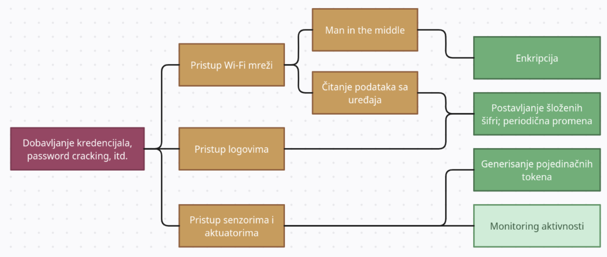
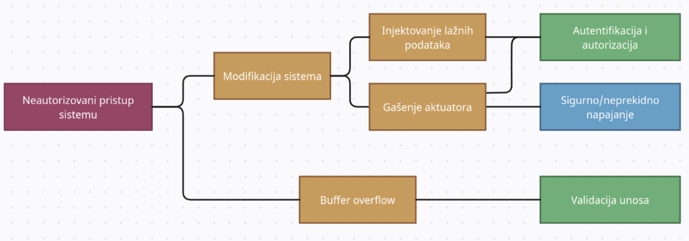
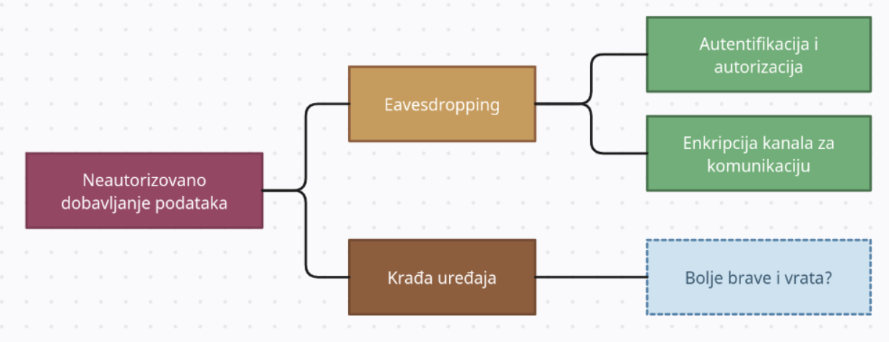
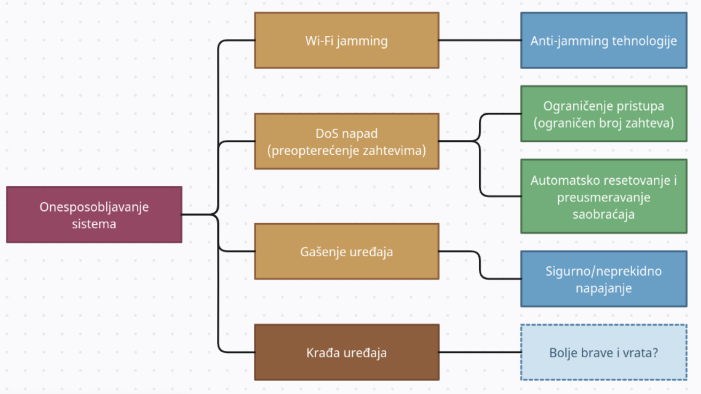
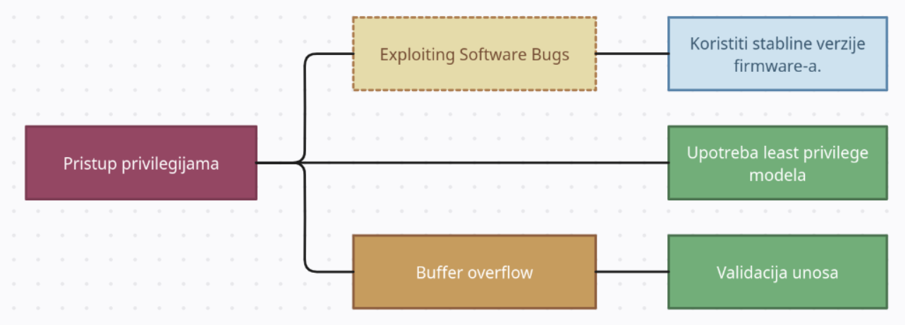

# Analiza rizika

U ovom dokumentu je izrađena analiza rizika za prethodno definisane [pretnje](analiza-pretnji.md).

Za svaki od dijagrama iz modela pretnji je odrađena procena rizika, gde je procenjeno: 
* **Verovatnoća:** Kolika je verovatnoća da se napad desi. Uzima u obzir zaštićenost sistema i lakoću sprovođenja napada.
* **Uticaj/šteta:** Potencijalna šteta koja može da se desi ukoliko se napad sprovede. U to se ubrajaju gubitak i izmena podataka, finansijski trošak, reputacija...
* **Rizik:** Računa se na osnovu verovatnoće napada i njegovog uticaja.

Za svaku stavku je korišćen vrednosni opseg od 1 do 3, gde je 3 jako nepovoljan rezultat.

 

## Procene

#### Pristup Wi-Fi mreži
* Verovatnoća: 3
* Uticaj: 3
* Rizik: 3

#### Pristup logovima
* Verovatnoća: 3
* Uticaj: 1
* Rizik: 2

#### Pristup senzorima i aktuatorima
* Verovatnoća: 2
* Uticaj: 3
* Rizik: 2

Ukoliko je mreža neosigurana, ima "default" kredencijale, ili slabe šifre, verovatnoća ovih napada je visoka. Ukoliko se na taj način ostvari pristup mreži, otvaraju se razne mogućnosti i pristup gotovo svim komponentama, jer sve funkcionišu u sklopu iste mreže, najčešće Wi-Fi.

 

#### Modifikacija sistema
* Verovatnoća: 2
* Uticaj: 2
* Rizik: 2

#### Buffer overflow
* Verovatnoća: 2
* Uticaj: 1
* Rizik: 2

I u ovom slučaju čvrsta mreža uz postavljen dobar mehanizam autentifikacije i autorizacije, kao i validacija komunikacije igraju bitnu ulogu u verovatnoći napada, zato ih je bitno sprovesti.

 

#### Eavesdropping
* Verovatnoća: 2
* Uticaj: 3
* Rizik: 2

#### Krađa uređaja
* Verovatnoća: 1
* Uticaj: 3
* Rizik: 1

Eavesdropping ima veliki uticaj, odnosno štetu, jer se mogu presresti jako bitni podaci, kao što su ključevi i tokeni, i jako je važno obezbediti sigurnu komunikaciju.

Krađa uređaja takođe ima veliki uticaj, jer osim onesposobljavanja samog sistema uzrokuje i finansijski trošak. Ipak, rizik je postavljen na 1, iako je prosečna vrednost 2, jer su fizički napadi, odnosno krađa uređaja izuzetno retki.

 

#### Wi-Fi jamming
* Verovatnoća: 3
* Uticaj: 1
* Rizik: 2

#### DoS
* Verovatnoća: 3
* Uticaj: 1
* Rizik: 2

#### TO DO
* Verovatnoća: 
* Uticaj: 
* Rizik: 

#### Krađa uređaja
* Verovatnoća: 1
* Uticaj: 3
* Rizik: 1

Wi-Fi- jamming kao i DoS napadi možda jesu među verovatnijim napadima, ali njihov uticaj nije velik, jer privremeno onesposobljava mrežu, bez dugoročnih posledica.

Kao što je prethodno opisano, krađa uređaja ima veliki uticaj, jer osim onesposobljavanja samog sistema uzrokuje i finansijski trošak. Ponovo, rizik je postavljen na 1, iako je prosečna vrednost 2, jer su fizički napadi, odnosno krađa uređaja izuzetno retki.

 

#### Exploiting Software Bugs
* Verovatnoća: 1 
* Uticaj: 3
* Rizik: 2

#### Buffer overflow
* Verovatnoća: 
* Uticaj: 
* Rizik: 

Eksploatacija bagova u ozbiljnim produkcionim sistemima je retka pojava, zbog toga je i verovatnoća ovakvog napada 1. Međutim, ukoliko se dese, često za sobom ostavljaju veliku štetu.

 

## Zaključak:
Najbitnije je osigurati samu mrežu u kojoj se nalaze Smart Home komponente, kao i kanale za komunikaciju. 

To podrazumeva pre svega postavljanje jakih i složenih šifri, koje je poželjno često i menjati, sprovođenje enkripcije prilikom komunikacije, kako transport podataka ne bi bio otkriven, kao i postavljanje privilegija, odnosno autorizacije za svaku od akcija koje sistem nudi.
To je neophodan korak, a nema finansijke preduslove za sprovođenje.

Osim toga, može se uvesti rate limiting, i njemu slični mehanizmi, koji dodatno osiguravaju mrežu od spoljnih napada.

Ukoliko se raspolaže finansijama, dobro je uložiti u dodatnu opremu poput anti-jamming uređaja.