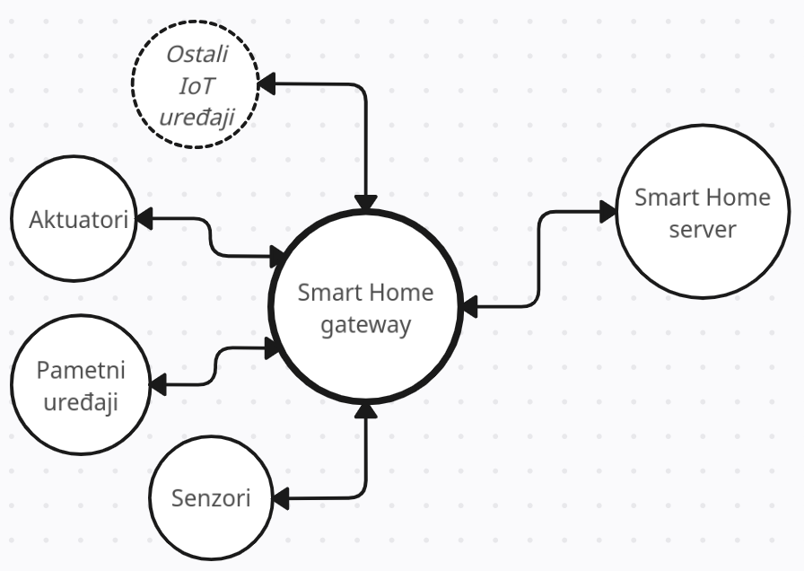

# Dekompozicija modula

Dekompozicija modula je izvršina na osnovu izdvojene arhitekture Smart Home sistema (predlog.md).

### Na visokom nivou

 
Na najvišem nivou su izdvojeni sledeći moduli
* Korisnička aplikacija - predstavlja interfejs preko kog korisnik Smart Home sistema stupa u kontakt sa sistemom, dobavlja informacije, upravlja sistemom, sprovodi komande, itd.
* Smart Home server - modul koji direknto komunicira sa Smart Home sistemom, prosleđuje korisnikove zahteve, dobavlja podatke, komunicira sa bazom, itd.
* Smart Home sistem - modul u kome se zapravo nalaze smart home komponente; spolja je "otkriven" preko smart home gateway-a

 

### Dekompozicija Smart Home servera 

 

Smart Home server se u određenoj meri ne može detaljno dekomponovati, jer to zavisi od same arhitekture aplikacije koja je na serveru.
Ona može biti monolitna, i kao takva sve komponente sadržati u sebi, može biti i servisno orijentisane ili mikroservisne arhitekture. Od toga će i zavisiti pristup prilikom modelovanja pretnji.

Ono što jeste sigurno je da će svaki Smart Home server da razmenjuje podatke između korisnika i gateway-a nekim protokolom za komunikaciju. Pored toga, imaće svoju bazu podataka, kao i sistem autentifikacije i autorizacije, kako bi samo pripadnici Smart Home sistema mogli da izvršavaju komande i imaju uvid u monitoring.

 

### Dekompozicija Smart Home sistema

 

Unutar samog Smart Home sistema se izdvajaju dve bitne komponente:
* Smart Home gateway - centralna jedinica, srž sistema, zadužen za kontrolu i komunikaciju sa spoljašnjim okruženjem
* Uređaji - smart sockets, senzori, pametni uređaji...

(terminologija je detaljnije definisana u predlogu projekta)