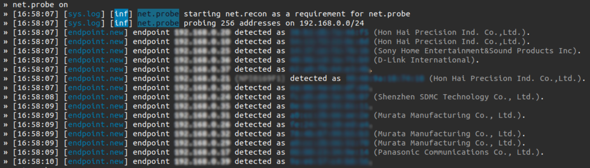

# Man in the Middle

U ovom dokumentu je detaljnije opisan Man in the Middle napad, odnosno kako se on izvodi. Napad se sprovodi upotrebom Bettercap-a [1].

## Bettercap

Bettercap je alat otvorenog koda namenjen za praćenje i analizu mreža. Sa sposobnošću da presreće i manipuliše saobraćajem, Bettercap omogućava korisnicima da analiziraju i testiraju sigurnost mreža. Njegove glavne karakteristike uključuju presretanje HTTP i TCP saobraćaja, ARP spoofing, DNS spoofing, kao i mogućnost snimanja i analize paketa u realnom vremenu.

Nakon što se alat instalira i pokrene, može se otpočeti sa otkrivanjem, odnosno identifikacijom uređaja na mreži, čak iako oni trenutno ne učestvuju u komunikaciji. To se postiže jednostavnom komandom: 
```sh
net.probe on
```
Izlaz ove komande, kao što je prethodno pomenuto, su uređaji koji su povezani na mrežu:



Sve informacije otkrivenih uređaja se mogu dobiti upotrebom komande:
```sh
net.show
```

<br>

### ARP spoofing i praćenje saobraćaja

Kada se odabere željeni uređaj, za njega se može pokrenuti ARP [2] spoofing, odnosno presretanje komunikacije između uređaja. Kako se u lokalnoj mreži koristi ARP (Address Resolution Protocol), da bi uređaji imali svest o tome koja adresa odgovara kojem uređaju, spoofing se koristi da bi zlonamerni uređaj lažno tvrdio da ima adresu nekog drugog uređaja. ARP spoofing i praćenje saobraćaja se u Bettercap alatu može pokrenuti na sledeći način, gde je ADDRESS adresa ciljnog uređaja:

```sh
set arp.spoof.targets [ADDRESS]
arp.spoof on
net.sniff on
```

Od ovog trenutka se može pratiti sva komunikacija koju ciljani uređaj obavlja na mreži. Dakle, nisu u pitanju samo vebsajtovi koje uređaj obilazi, već sav saobraćaj tog uređaja. Ovo može biti jako opasno ukoliko se ne koristi enkripcija prilikom prenosa podataka, jer će osetljivi podaci poput korisničkih naloga i šifri biti vidljivi napadaču. Na primer, ukoliko Smart Home klijentska aplikacija ne koristi HTTPS, već običan HTTP, sa minimalnim uloženim trudom se može pročitati korisnikova šifra.

<br>

### DNS modifikacija

Redirekcija saobraćaja se može postići modifikacijom DNS-a [3], odnosno DNS spoofing-om. To se postiže tako što se lažiraju odgovori Domain Name System servera, odnosno kada uređaj zatraži IP adresu željenog sajta, MitM će mu poslati lažnu adresu na koju želi da ga preusmeri. To se u Bettercap-u postiže sledećim komandama: 

```sh
set dns.spoof.domains [target-website.com] [redirect-website.com]
dns.spoof on
```
U ovoj komandi, "target-website.com" je onaj vebsajt sa kog želimo da preusmerimo saobraćaj, dok je "redirect-website.com" onaj na koji želimo da ga preusmerimo.

Na ovaj način, man in the middle, odnosno napadač, može napraviti kopiju Smart Home aplikacije, i preusmeriti sav saobraćaj na nju. Korisnik, ukoliko ne primeti da se nalazi na drugom URL-u, može pokušati da pristupi svom korisničkom nalogu, i na taj način ostavi napadaču svoje kredencijale.

<br>

### Vebsajt modifikacija

Ako veb stranica, na primer stranica Smart Home sistema, koju ciljani uređaj posećuje, koristi običan HTTP, to znači da se njen sadržaj u celosti prenosi bez enkripcije. To dalje znači da se taj isti sadržaj može čitati i menjati u letu, odnosno pre stizanja na uređaj koji je tražio stranicu.

```javascript
window.onload + function() {
    let anchors = document.getElementsByTagName('a');
    for(let i = 0; i < anchors.length; i++) {
        anchors[i].href = 'https://www.my-website.rs/';
    }
}
```

Na primer, vebsajt se može izmeniti tako da svi linkovi na stranici vode na veb stranicu koju mi želimo, kao što je prikazano u JavaScript kodu iznad. Na isti način se može umetnuti i mnogo opasniji kod, poput krađe storage varijabli, dodavanje malicioznih formi, itd.

Za modifikaciju sadržaja koji se prenosi se koristi HTTP proxy [4], to jest, sav sadržaj će morati prvo da prođe kroz postavljen proxy. Na taj način on može da se modifikuje, i onda propusti dalje do krajnjeg uređaja. To se Bettercap alatom postiže na sledeći način, gde je FILE-PATH putanja do JavaScript fajla koji vrši modifikaciju stranice:

```sh
set http.proxy.injectjs [FILE-PATH]
http.proxy.on
```

<br>

## Rešenje

Da bismo se sačuvali od MitM napada, enkripcija komunikacijskih kanala igra ključnu ulogu. Potrebno je sprovesti TLS, odnosno Transport Layer Security, kriptografski protokol koji enkriptuje podatke koji se šalju između uređaja, tako da u slučaju presretanja oni budu u nečitljivom formatu. Pored TLS-a, važno je primeniti HTTP Strict Transport Security (HSTS), odnosno web sigurnosni mehanizam koji štiti od MitM napada tako što forsira komunikaciju isključivo preko sigurne HTTPS konekcije, umesto putem običnog HTTP-a.

<br>

## Literatura:

[1] https://www.bettercap.org/

[2] https://www.fortinet.com/resources/cyberglossary/what-is-arp

[3] https://www.cloudflare.com/learning/dns/what-is-dns/

[4] World-Wide Web Proxies: Ari Luotonen (CERN), Kevin Altis (Intel)
