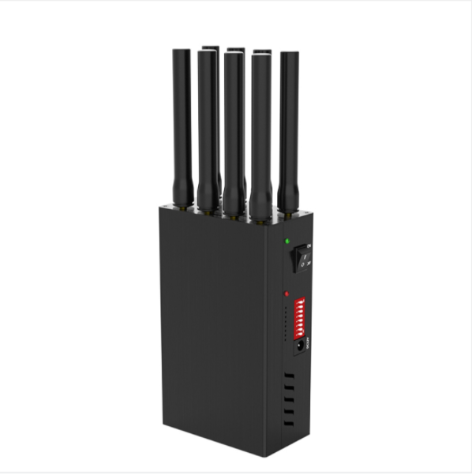
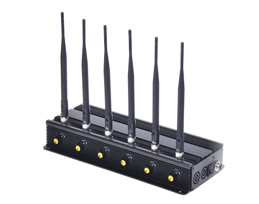

# Wi-Fi jamming

U ovom dokumentu je prikazano sprovođenje [Wi-Fi jamming napada](analiza-pretnji.md#wi-fi-jamming). Ovi napadi se oslanjaju na upotrebu Wi-Fi jammer-a, odnosno uređaja koji preplavljuju mrežu radio frenkvencijama, kako bi istu onesposobili da prima podatke.

*Wi-Fi jamming uređaji*

 

Kako se cene ovih uređaja kreću po nekoliko stotina, pa i hiljada dolara, a pritom je njihova upotreba nelegalna, za akademske potrebe izvođenja ovog napada upotrebljen je ESP8266 mikročip [1][2] na NodeMCU tabli [3]. 

NodeMCU je platforma za izradu prototipova IoT projekata koja se zasniva na ESP8266 mikročipu. Ova platforma omogućava pisanje softvera u različitim jezicima kao što su Lua, C++ i MicroPython, što pruža fleksibilan razvoj. NodeMCU sadrži ESP8266 Wi-Fi mikročip, koji ima ugrađen TCP/IP modul, što mu omogućava da se poveže na Wi-Fi mrežu i izvršava jednostavne TCP/IP konekcije.

ESP8266 mikročip, srce NodeMCU platforme, je niskobudžetni Wi-Fi mikročip sa punim TCP/IP stekom i mikrokontrolerskom funkcionalnošću. Proizveden je od strane Espressif Systems-a, kompanije iz Šangaja, koja se bavi proizvodnjom čipova, IoT i cloud rešenjima. Sa malim dimenzijama i niskom potrošnjom energije, ovaj čip je pogodan za projekte gde su prostor i energetska efikasnost ključni. 

Zbog svoje pristupačne cene, ESP8266 je privukao mnoge hakere da istražuju čip i softver na njemu.

*NodeMCU ESP8266*

 

## Napad

Za razliku od standardnog Wi-Fi jamming napada, koji šalje radio frekvencije koje se sukobljavaju sa uređajima, ovaj napad se zasniva na slanju deauthentication frame-ova (okvira) [4]. Deauthentication frame je tip paketa definisan u IEEE 802.11 Wi-Fi standardu. Bio je deo standarda od samog početka i još uvek ima važnu ulogu. Predstavlja poruku koja se šalje između uređaja i Wi-Fi rutera, koja efektivno kaže "prekidamo našu Wi-Fi vezu". U normalnim okolnostima, ova poruka se koristi za sigurno i ispravno prekidanje veze između uređaja i rutera.

 

Deauthentication frame spada u Wi-Fi management frame-ove. U sledećoj tabeli je prikazana struktura deauthentication frame-a [4]:

| Polje                      | Opis/Informacije  |
|----------------------------|-----------------------------------------------------------------------------------------------------------------------------------------------------------------------------------------------|
| Frame Control Field        | Ovo je prvo polje u svakom Wi-Fi frame-u. Sadrži nekoliko bitova koji definišu tip i podtip okvira (u ovom slučaju, deauthentication).                                                        |
| Duration Field             | Ovo polje određuje vreme koje je potrebno da se paket u potpunosti prenese i da se potvrdi njegov prijem.                                                                                     |
| Addresses                  | Postoje dve bitne MAC adrese u deauthentication frame-u: Receiver Address (RA), odnosno adresa uređaja koji prima frame, i Transmitter Address (TA). odnosno adresa uređaja koji šalje frame. |
| Sequence Control Field     | Sadrži informacije o sekvenci, odnosno fragmentima frame-a. Koristi se za praćenje redosleda prijema frame-ova.                                                                               |
| Reason Code                | Ovo polje sadrži kod koji objašnjava razlog deautentikacije.                                                                                                                                  |
| Frame Check Sequence (FCS) | Polje za kontrolu grešaka koje se nalazi na kraju svakog frame-a. Koristi se za proveru integriteta prenesenih podataka.                                                                      |

Postoji preko 50 kodova [4] za razloge deautentifikacije. Neki od njih su Unspecified reason, Previous authentication no longer valid, Disassociated due to inactivity, itd.

 

Sve što je potrebno od informacija za ovaj napad je MAC adresa pošiljaoca ili primaoca, koja se vrlo lako može dobiti skeniranjem Wi-Fi uređaja u blizini. Lako je poslati deauth paket, a kada ga ciljni uređaj primi, on mora da prekine svoju vezu. Uređaj se može odmah ponovo povezati, naravno, i to može učiniti veoma brzo, možda čak i bez da korisnik primeti da je veza ikada bila prekinuta. Ali, ako se paketi šalju neprekidno, mreža postaje zatrpana, odnosno dolazi do jamming napada. Tada je pristup mreži blokiran za vreme trajanja napada.

Srećom, sada postoje protected management frames [5] koji rešavaju ovaj problem. PMF omogućava bezbedan prenos deauthentication frame-ova, tako što pruža enkripciju istih i sprečava njihov spoofing. Takođe, sprovodi obostranu autentifikaciju, odnosno uređaj i Wi-Fi ruter moraju međusobno da se autentifikuju pre nego što se frame prihvati. Jedini problem ove funkcionalnosti je što još uvek nije široko sprovedena, te je većina 2.4GHz Wi-Fi mreža još uvek podložna ovom napadu.

 

### Priprema i instalacija

Kako se ovaj napad oslanja na ubotrebu ESP8266 čipa, pre svega je potrebno na njega ubaciti firmware, to jest kod koji će izvršavati prethodno opisani napad, odnosno skeniranje Wi-Fi mreža, a potom i kontinualno slanje deauthentication frame-ova. Da bi se to postiglo, prvo je potrebno povezati uređaja na računar, običnom USB konekcijom, a potom mu ubaciti kod, upotrebom nekog razvojnog okruženja za mikrokontrolere, kao što je Arduino IDE [6].

* todo: kod

### Izvršavanje napada
* todo: proces kroz interfejs

 

## Literatura:

[1] https://www.espressif.com/en/products/socs/esp8266

[2] https://hackaday.com/2014/08/26/new-chip-alert-the-esp8266-wifi-module-its-5/

[3] https://github.com/nodemcu/nodemcu-devkit

[4] https://blog.spacehuhn.com/wifi-deauthentication-frame

[5] https://www.wi-fi.org/knowledge-center/faq/what-are-protected-management-frames

[6] https://www.arduino.cc/en/software